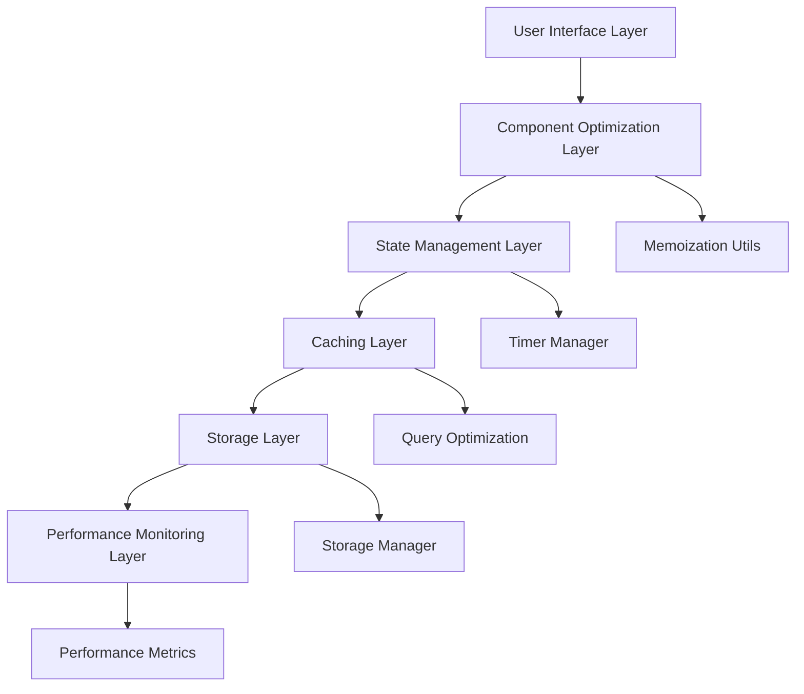

# Performance Optimization Design

## Overview

This design outlines a comprehensive performance optimization strategy for the ninja-themed productivity app. The optimizations focus on React Query caching, component memoization, localStorage management, code splitting, efficiency calculation optimization, and timer management improvements. All optimizations maintain existing functionality while significantly improving performance.

## Architecture

### Performance Optimization Layers



### Optimization Strategy

1. **React Query Optimization**: Implement intelligent caching strategies with optimized stale times and selective invalidation
2. **Component Memoization**: Add strategic memoization to prevent unnecessary re-renders
3. **Storage Optimization**: Centralize localStorage operations with batching and cleanup
4. **Code Splitting**: Implement lazy loading for routes and heavy components
5. **Calculation Optimization**: Optimize efficiency calculations with caching and batching
6. **Timer Optimization**: Consolidate timer management and reduce localStorage writes

## Components and Interfaces

### 1. Query Configuration Manager

```typescript
interface QueryConfig {
  staleTime: number;
  cacheTime: number;
  refetchOnWindowFocus: boolean;
  retry: number | ((failureCount: number, error: Error) => boolean);
}

interface OptimizedQueryKeys {
  routines: (userId: string) => readonly string[];
  tasks: (routineId: string | null) => readonly string[];
  efficiencyStats: (userId: string) => readonly string[];
  taskPerformance: (userId: string) => readonly string[];
}
```

### 2. Memoization Utilities

```typescript
interface MemoizationConfig {
  shouldMemoize: boolean;
  dependencies: readonly unknown[];
  equalityFn?: (prev: unknown[], next: unknown[]) => boolean;
}

interface ComponentMemoProps {
  children: React.ReactNode;
  dependencies: readonly unknown[];
  displayName?: string;
}
```

### 3. Storage Manager

```typescript
interface StorageManager {
  get<T>(key: string, defaultValue?: T): T | null;
  set<T>(key: string, value: T): void;
  remove(key: string): void;
  batchSet(operations: Array<{ key: string; value: unknown }>): void;
  cleanup(pattern: RegExp): void;
  getStorageSize(): number;
}

interface StorageConfig {
  prefix: string;
  maxSize: number;
  cleanupThreshold: number;
  batchDelay: number;
}
```

### 4. Performance Monitor

```typescript
interface PerformanceMetrics {
  renderTime: number;
  componentCount: number;
  memoryUsage: number;
  cacheHitRate: number;
  storageOperations: number;
}

interface PerformanceMonitor {
  startMeasurement(name: string): void;
  endMeasurement(name: string): number;
  getMetrics(): PerformanceMetrics;
  reportBottlenecks(): string[];
}
```

### 5. Timer Manager

```typescript
interface TimerManager {
  createTimer(id: string, duration: number, callback: () => void): void;
  pauseTimer(id: string): void;
  resumeTimer(id: string): void;
  removeTimer(id: string): void;
  batchUpdate(updates: Array<{ id: string; timeLeft: number }>): void;
  getActiveTimers(): string[];
}
```

## Data Models

### Optimized Query Structures

```typescript
// Optimized query key factory
const queryKeys = {
  all: ['app'] as const,
  routines: (userId: string) => [...queryKeys.all, 'routines', userId] as const,
  routine: (routineId: string) => [...queryKeys.all, 'routine', routineId] as const,
  tasks: (routineId: string | null) => [...queryKeys.all, 'tasks', routineId] as const,
  efficiencyStats: (userId: string) => [...queryKeys.all, 'efficiency', userId] as const,
  taskPerformance: (userId: string) => [...queryKeys.all, 'performance', userId] as const,
} as const;

// Optimized query configurations
const queryConfigs = {
  routines: {
    staleTime: 5 * 60 * 1000, // 5 minutes
    cacheTime: 10 * 60 * 1000, // 10 minutes
    refetchOnWindowFocus: false,
  },
  tasks: {
    staleTime: 2 * 60 * 1000, // 2 minutes
    cacheTime: 5 * 60 * 1000, // 5 minutes
    refetchOnWindowFocus: false,
  },
  efficiencyStats: {
    staleTime: 1 * 60 * 1000, // 1 minute
    cacheTime: 5 * 60 * 1000, // 5 minutes
    refetchOnWindowFocus: true,
  },
} as const;
```

### Memoization Patterns

```typescript
// Component memoization wrapper
const MemoizedComponent = React.memo(Component, (prevProps, nextProps) => {
  // Custom equality check for complex props
  return shallowEqual(prevProps, nextProps);
});

// Hook memoization patterns
const useOptimizedCalculation = (data: unknown[], dependencies: readonly unknown[]) => {
  return useMemo(() => {
    return expensiveCalculation(data);
  }, dependencies);
};

const useOptimizedCallback = (fn: Function, dependencies: readonly unknown[]) => {
  return useCallback(fn, dependencies);
};
```

## Error Handling

### Performance Monitoring Error Handling

```typescript
class PerformanceError extends Error {
  constructor(
    message: string,
    public readonly metric: string,
    public readonly threshold: number,
    public readonly actual: number
  ) {
    super(message);
    this.name = 'PerformanceError';
  }
}

const handlePerformanceIssue = (error: PerformanceError) => {
  console.warn(`Performance issue detected: ${error.message}`, {
    metric: error.metric,
    threshold: error.threshold,
    actual: error.actual,
  });
  
  // Report to monitoring service if available
  if (window.performance && window.performance.mark) {
    window.performance.mark(`performance-issue-${error.metric}`);
  }
};
```

### Storage Error Handling

```typescript
const handleStorageError = (error: Error, operation: string, key: string) => {
  console.error(`Storage operation failed: ${operation}`, { key, error });
  
  // Fallback to memory storage if localStorage fails
  if (error.name === 'QuotaExceededError') {
    // Trigger cleanup and retry
    storageManager.cleanup(/^routine-.*-temp$/);
    return true; // Indicate retry should be attempted
  }
  
  return false;
};
```

## Testing Strategy

### Performance Testing

1. **Render Performance Tests**
   - Measure component render times using React DevTools Profiler
   - Test memoization effectiveness with prop change scenarios
   - Validate re-render prevention in optimized components

2. **Query Performance Tests**
   - Test cache hit rates for common query patterns
   - Validate stale-while-revalidate behavior
   - Test selective invalidation effectiveness

3. **Storage Performance Tests**
   - Measure localStorage operation times
   - Test batch operation efficiency
   - Validate cleanup mechanism effectiveness

4. **Memory Leak Tests**
   - Test timer cleanup on component unmount
   - Validate query cache cleanup
   - Test storage cleanup mechanisms

### Benchmark Tests

```typescript
// Example performance benchmark
const benchmarkComponent = async (Component: React.ComponentType, props: any) => {
  const startTime = performance.now();
  
  render(<Component {...props} />);
  
  const renderTime = performance.now() - startTime;
  
  expect(renderTime).toBeLessThan(16); // 60fps threshold
};

// Query performance test
const benchmarkQuery = async (queryFn: () => Promise<any>) => {
  const startTime = performance.now();
  
  await queryFn();
  
  const queryTime = performance.now() - startTime;
  
  expect(queryTime).toBeLessThan(100); // 100ms threshold
};
```

### Integration Tests

1. **End-to-End Performance Tests**
   - Test complete routine execution performance
   - Validate efficiency calculation performance with large datasets
   - Test app performance under heavy usage scenarios

2. **Cross-Browser Performance Tests**
   - Test performance optimizations across different browsers
   - Validate localStorage performance on various devices
   - Test timer accuracy across different environments

## Implementation Phases

### Phase 1: Query Optimization
- Implement optimized query configurations
- Add selective invalidation patterns
- Optimize query key structures

### Phase 2: Component Memoization
- Add React.memo to frequently re-rendering components
- Implement useMemo for expensive calculations
- Add useCallback for stable function references

### Phase 3: Storage Optimization
- Create centralized storage manager
- Implement batching for storage operations
- Add automated cleanup mechanisms

### Phase 4: Code Splitting
- Implement lazy loading for route components
- Add dynamic imports for heavy components
- Optimize bundle splitting configuration

### Phase 5: Calculation Optimization
- Optimize efficiency calculation algorithms
- Add caching for intermediate results
- Implement batching for multiple calculations

### Phase 6: Timer Optimization
- Consolidate timer management
- Reduce localStorage write frequency
- Optimize visibility change handling

## Performance Targets

- **Initial Load Time**: < 2 seconds on 3G connection
- **Component Render Time**: < 16ms (60fps)
- **Query Response Time**: < 100ms for cached data
- **Storage Operation Time**: < 5ms for batch operations
- **Memory Usage**: < 50MB for typical usage
- **Bundle Size Reduction**: 20-30% through code splitting
- **Re-render Reduction**: 40-60% through memoization
- **Cache Hit Rate**: > 80% for frequently accessed data